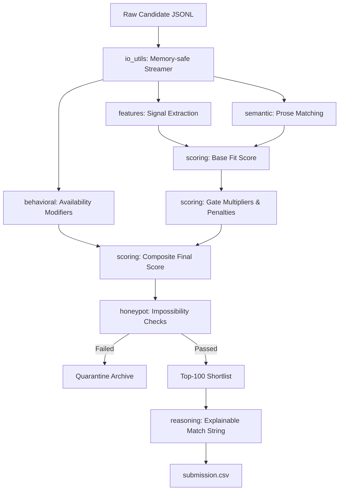

# MindSpark — Intelligent Candidate Discovery & Ranking Pipeline

A complete, end-to-end, and auditable candidate ranking engine built for the **Redrob Candidate Discovery & Ranking Challenge**. This system ranks a pool of 100,000 candidates for a **Senior AI Engineer — Founding Team** role. It operates in under **70 seconds on a single CPU core**, utilizing no active network or LLMs at runtime.

---

## 1. Architectural Overview

The core philosophy of this project is **interpretability and robust adversarial defense**. Instead of feeding raw text into an expensive, black-box LLM, the pipeline extracts structured, recruiter-inspired signals and runs them through a deterministic scoring formula.



### The Scoring Equation

For every candidate, the final score is calculated in two phases:

$$Score = BaseFit \times BehavioralMultiplier \times Penalties \times Bonuses$$

#### Phase 1: Base Fit Score (Weighted Sum of 7 Signals)
* **Title & Career Relevance (26%)**: Checks job title hierarchy (ML Engineer, AI Engineer, Backend, etc.).
* **Career Evidence (22%)**: Phrase matching for concrete project delivery (e.g., recommender systems, vector search).
* **Skills Trust (18%)**: Counts core skills, heavily discounted if they have no endorsements or months of experience (stops skill-pasting).
* **Semantic Match (14%)**: Vector/TF-IDF similarity against 6 distinct themes of the Job Description.
* **Experience Fit (10%)**: Ideal 6–8 years band (5–9 soft band) with smooth interpolation.
* **Location Fit (6%)**: Pune and Noida preferred, Tier-1 with relocation intent welcomed.
* **Education (4%)**: Degree tiers (Tier 1-4) plus STEM specialization and degree-level boosts (PhD/Master's).

#### Phase 2: Multipliers & Constraints
* **Services-Only Career Penalty ($\times 0.55$)**: Down-weights candidates whose careers have been entirely in services/consulting firms (TCS, Infosys, Wipro, Accenture).
* **Distractor Penalty ($\times 0.70$)**: Down-weights CV/Speech AI candidates who have no NLP/Information Retrieval experience.
* **Stopped Coding Penalty ($\times 0.80$)**: Down-weights candidates who have transitioned entirely to people management.
* **Product Company Bonus ($\times 1.04$)**: Boosts candidates with experience at renowned product firms (Google, Flipkart, Zoox, etc.).
* **Honeypot Disqualification ($\times 0.02$)**: Strongly filters out profiles with impossible/contradictory data details.

---

## 2. File-by-File Code Walkthrough

All processing code is organized under the [src/](file:///c:/Users/Priyanshu/Downloads/redrob-ranker/src) directory:

### 1. [jd_spec.py](file:///c:/Users/Priyanshu/Downloads/redrob-ranker/src/jd_spec.py)
* **Purpose**: Serves as the single source of truth for the job description requirements.
* **Details**: Encodes list structures for preferred cities, product company keywords, distractor skills (Computer Vision, Speech Recognition), services companies, and high-value search engineering evidence phrases (e.g., `hnsw`, `colbert`, `dense retrieval`, `ndcg`).

### 2. [io_utils.py](file:///c:/Users/Priyanshu/Downloads/redrob-ranker/src/io_utils.py)
* **Purpose**: Performs memory-safe streaming of input files.
* **Details**: Iterates over compressed `.gz` or normal `.jsonl` datasets line-by-line, yielding candidate dictionaries one-by-one. This prevents loading the 487MB dataset into memory, keeping RAM usage below 2 GB.

### 3. [features.py](file:///c:/Users/Priyanshu/Downloads/redrob-ranker/src/features.py)
* **Purpose**: Translates candidate data profiles into parsed numeric signals.
* **Details**:
  - `experience_score`: Interpolates years of experience (YOE) smoothly between ideal bands.
  - `skills_trust_score`: Validates that a candidate's skills are believable by verifying they have either endorsements or months of usage duration.
  - `education_score`: Evaluates institutional tiers and awards boosts for advanced STEM degrees (PhD, Master's, MS, MTech).
  - Includes null-safe checks `(cand.get("profile") or {})` to prevent crashes when input JSON contains null fields.

### 4. [semantic.py](file:///c:/Users/Priyanshu/Downloads/redrob-ranker/src/semantic.py)
* **Purpose**: Calculates the conceptual matching between candidate profile text and the Job Description.
* **Details**: Handles two backends:
  - **TF-IDF Backend** (Default / Offline): Runs scikit-learn offline vectorization to compute cosine similarity against JD facets.
  - **Embedding Backend** (sentence-transformers): If a pre-computed embedding `.npy` cache exists, maps vectors instantly on CPU for high-fidelity semantic similarity.

### 5. [behavioral.py](file:///c:/Users/Priyanshu/Downloads/redrob-ranker/src/behavioral.py)
* **Purpose**: Scores candidate availability and responsiveness.
* **Details**: Binds active responsiveness and notice periods (e.g., immediate joiner boosts) to an availability multiplier. Implements a strict **Ghost Gate** that heavily penalizes candidates who have low response rates ($\le 12\%$) and long inactivity periods. Fully guarded against unclean data anomalies (like float-as-string notice periods or percentages) using custom, robust type parsing.

### 6. [honeypot.py](file:///c:/Users/Priyanshu/Downloads/redrob-ranker/src/honeypot.py)
* **Purpose**: Detects impossible profile records.
* **Details**: Scans for 5 specific logical inconsistencies:
  1. Stating "Expert" proficiency in a skill but listing 0 months of use.
  2. Stated years of experience much lower than cumulative career history tenure.
  3. Inverted dates (`end_date < start_date`) or future dates in roles.
  4. Listing a skill duration longer than the candidate's entire career duration.
  5. Earliest career start date implying far more experience than stated YOE.
  
  Uses robust `.get("name", "Unknown")` indexing to safeguard against `KeyError` in case of malformed or anonymous skill structures.

### 7. [scoring.py](file:///c:/Users/Priyanshu/Downloads/redrob-ranker/src/scoring.py)
* **Purpose**: Blends features, semantic scores, availability, and penalties.
* **Details**: Enforces score normalization using a combination of robust linear scaling and rank curves. This outputs a display score between `0.08` and `0.99` that remains monotonically decreasing.

### 8. [reasoning.py](file:///c:/Users/Priyanshu/Downloads/redrob-ranker/src/reasoning.py)
* **Purpose**: Generates natural-language reasoning explanations.
* **Details**: Rather than using an LLM (which introduces latency and hallucination risks), it compiles facts from the scoring attributes (e.g., actual YOE, matched core stack, location, notice period, and specific profile concerns).

---

## 3. The Streamlit Portal Sandbox

[app.py](file:///c:/Users/Priyanshu/Downloads/redrob-ranker/app.py) provides an interactive portal dashboard designed to demonstrate the model's metrics and allow real-time exploration. Ingestion is fully robust, supporting both raw JSONL streams and standard pretty-printed JSON arrays/lists out of the box.

### Key Panels:
1. **Analytics KPI Cards**: View dataset statistics like average experience, top candidate locations, core skill distribution, and product vs. services ratios.
2. **Interactive Filters**: Dynamic sidebars to filter candidates instantly by YOE, notice period, location preference, minimum score, and specific technical skills (e.g. `FAISS`, `LlamaIndex`).
3. **Quarantine Audit Panel**: View caught honeypot records along with the specific reasons they were flagged.
4. **Explainable Cards**: Color-coded progress bars demonstrating breakdown scores for Title Match, Semantic Fit, Skills, Location, and Education.

### How to Run Locally:
```bash
pip install -r requirements.txt
streamlit run app.py
```

---

## 4. Operational and Developer Commands

### 1. Re-Run Ranking Pipeline
Generate the official candidate shortlist submission:
```bash
python rank.py --candidates ./candidates.jsonl --out ./submission.csv --no-embeddings
```
*Processes 100,000 records, filters out honeypots, keeps the top 100, and writes the output.*

### 2. Run Submission Validator
Validate the final submission file against the challenge criteria:
```bash
python validate_submission.py submission.csv
```

### 3. Run Test Suite
Verify code integrity with all unit tests:
```bash
python tests/test_smoke.py
```
*Runs all 10 smoke tests, including tests for keyword-stuffing, honeypot detection, ghost penalization, and null field safety.*

### 4. Pre-Compute Semantic Embeddings (Optional)
If you want to use sentence-transformers embeddings instead of TF-IDF similarity, pre-compute candidate embeddings offline:
```bash
python build_embeddings.py --candidates ./candidates.jsonl --out data/candidate_embeddings.npy
```
When `rank.py` is run without the `--no-embeddings` flag, it will automatically load this `.npy` file.
